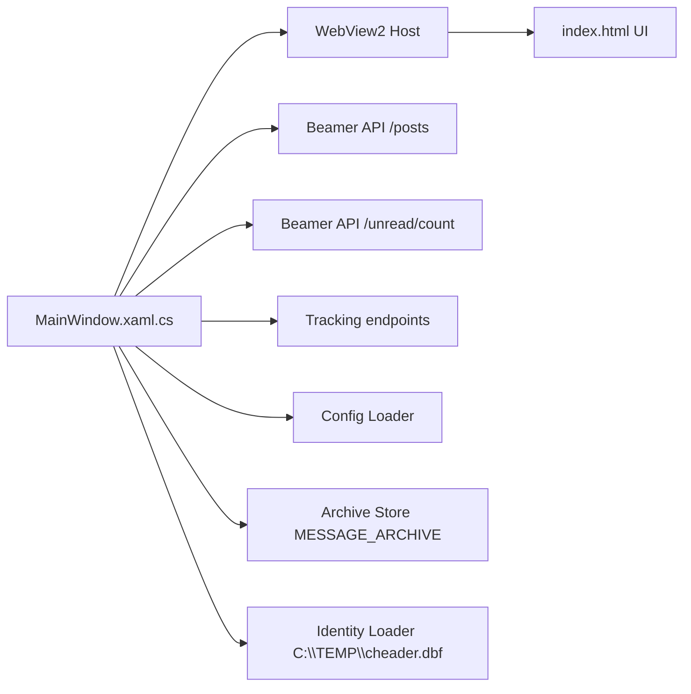
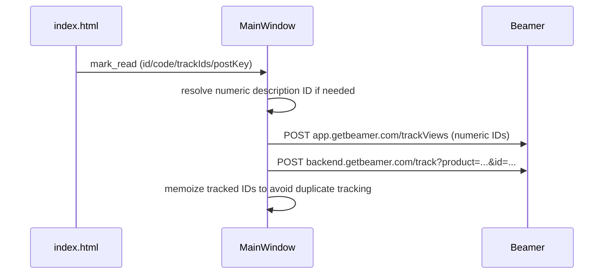

# Technical Architecture

## 1. Stack

- Desktop shell: WPF (`net8.0-windows`)
- Web UI host: WebView2
- UI rendering: local embedded `index.html`
- Network: `HttpClient` against Beamer API and tracking endpoints
- Storage: JSON config + local archive JSON files

## 2. High-Level Components

## 3. Boot Flow

1. `AppConfig.LoadOrCreate()` resolves and normalizes config.
2. `MainWindow` sets title from `Ui.AppTitle`.
3. Archive directory is created (`MESSAGE_ARCHIVE`).
4. Identity is loaded from config/DBF/fallback.
5. WebView2 initializes and serves embedded `index.html` from a writable local app folder.
6. Host injects boot payload (`window.__BV_CFG__`).
7. Frontend sends `ui_ready`.
8. Host starts polling loop.

## 4. Polling and Sync Strategy

Polling runs every `RefreshMs` (minimum 1000 ms).

### Poll decision logic

- Always calls unread count endpoint first.
- Fetches posts when:
  - first load, or
  - unread count changed, or
  - fallback timer elapsed (`~3 minutes`) if unread endpoint fails.

### Result handling

- Sorts posts by date descending.
- Limits to `MaxPosts`.
- Detects newly appeared post IDs.
- Forces app foreground on new post.
- Publishes state to UI via WebView message channel.

## 5. API Calls

### Content endpoints

- `GET {ApiBaseUrl}/posts`
- `GET {ApiBaseUrl}/unread/count`

### Auth fallback sequence

The app tries auth modes in order, then sticks to the last successful mode:

1. `Authorization: Bearer <ApiKey>`
2. `X-Beamer-API-Key` / `Beamer-API-Key`
3. `X-API-Key` / `API-Key`
4. `api_key` query parameter

### Query parameters

The app includes multiple identity and product aliases for compatibility:

- `product_id` and `productId`
- viewer identity variants (`user_id`, `custom_user_id`, `firstname`, etc.)

## 6. Tracking Flow (Post Views)

Tracking is triggered when user clicks `OK`.

Additional details:

- Numeric IDs use `trackViews` endpoint first.
- Non-numeric IDs rely on `backend /track`.
- Description ID can be resolved by scraping `loadMoreNews` HTML cache when needed.

## 7. UI/Host Message Contract

From UI to host:

- `ui_ready`
- `open_external`
- `mark_read`
- `save_ui_settings`

From host to UI:

- `state`
- `archive_state`
- `ui_config`
- `ui_settings_saved`

## 8. Archive Model

- Archive path: `<exe-folder>/MESSAGE_ARCHIVE`
- Format: one JSON file per source post
- Write behavior:
  - New posts are archived when fetched
  - Acknowledged posts are also archived
  - Duplicate source keys are skipped

The UI displays merged data:

- current API posts
- archived posts not already represented by live keys

## 9. Identity Model

Viewer identity priority:

1. Config overrides: `ViewerName`, `ViewerUserId`
2. DBF values: `Cname`, `Cthisreg` from `C:\TEMP\cheader.dbf`
3. Machine/account fallback

## 10. Focus/Foreground Behavior

On new-message detection, app currently forces foreground behavior (`BringToFront(force: true)`), including restore from minimized state.

## 11. Config + Theme Runtime Updates

- `Ui` settings are sent to frontend at boot and on `ui_ready`.
- Secret menu `Save & Close` sends new values to host.
- Host validates values, persists config, updates title, sends `ui_config` back.
- Successful save disables secret menu for next run (`Ui.EnableSecretMenu=false`).
